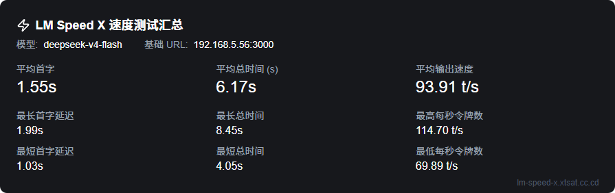
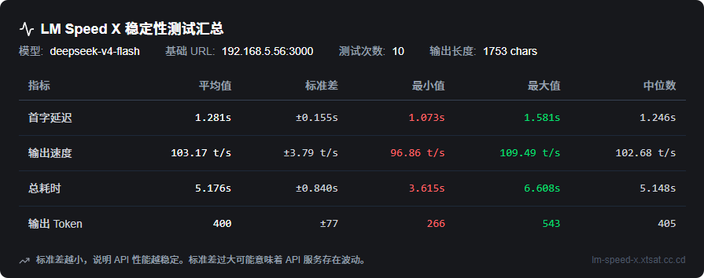
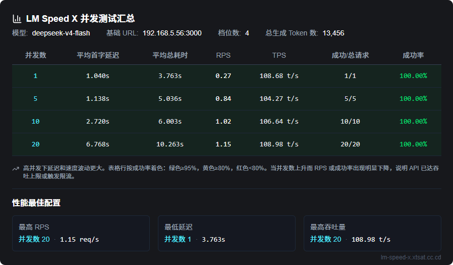
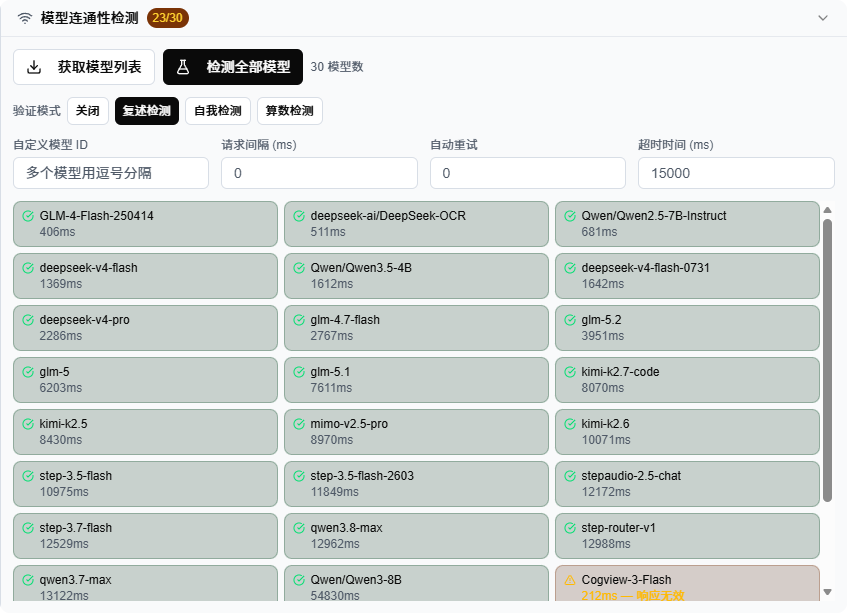
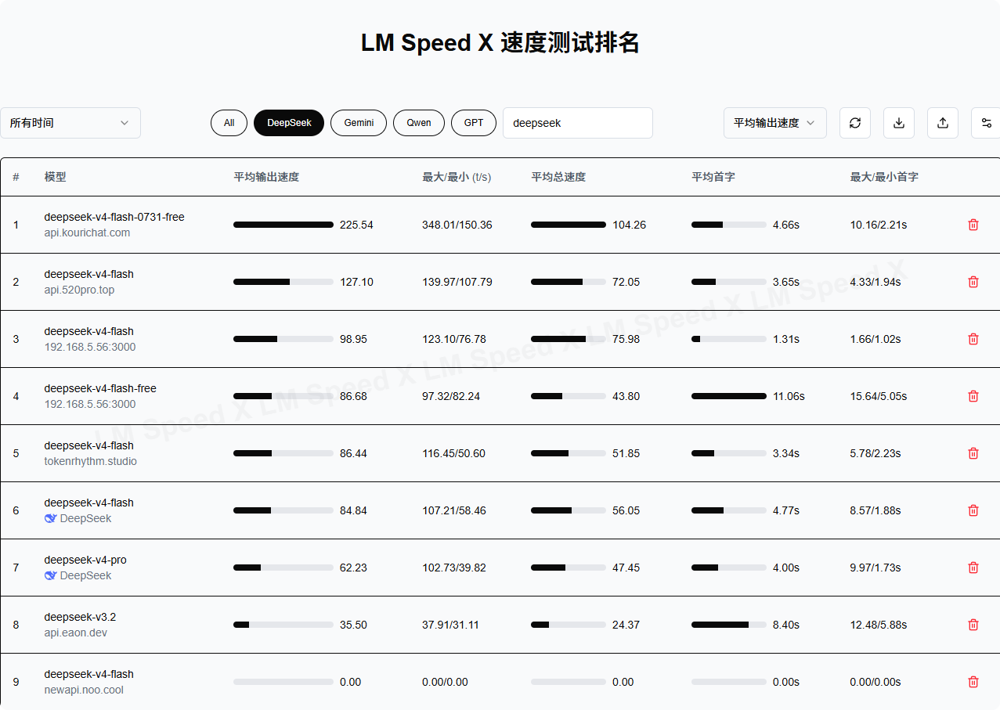

中文 | [English](README.md)

# LM Speed - 简单的大模型测速分析工具

传送门：<https://lm-speed-x.xtsat.cc.cd>

为 AI 应用开发者提供精准可靠的 OpenAI API 性能测试解决方案，通过多维度的实时数据分析，帮助用户快速定位性能瓶颈，优化模型调用策略。同时提供直观的排行榜功能，让用户能够轻松比较和选择最适合的模型和服务商。

## 功能特点 | Features

- ⚡ **实时速度测试**：支持任意 OpenAI 兼容接口（DeepSeek、硅基流动、腾讯云等），填写自定义 `baseUrl`、`apiKey` 和 `modelId` 即可开始。内置五个提示词，流式请求实时展示进度，精确测量首字延迟、每秒令牌数（TPoS）与总响应时间。
- 📊 **稳定性测试**：可配置轮次（默认 10 轮）连续测试，输出完整的统计画像——首字延迟、TPoS、输出令牌、总时间的均值、中位数、标准差、方差、最小/最大值。
- 🚦 **并发压力测试**：支持多级并发（如 1 / 5 / 10 / 20）压测，逐级统计成功率、RPS、平均延迟、p99 延迟与平均 TPoS，并自动推荐性能最佳的服务配置。
- 🛜 **连通性检查**：测速前批量校验模型可达性，涵盖延迟、重试次数、层级限制与内容有效性检测，配置问题提前暴露、及时修正。
- 🧠 **模型真实性验证**：识别伪装通用 AI 的代理模型。内置四重检测：PONG 响应检测、自报家门检测（识别冒充真模型的代理）、数学推理验证、图片识别验证。
- 🏆 **排行榜与对比**：所有本地测试结果自动汇聚成排行榜，支持时间范围筛选、主流模型快捷标签、自定义搜索、按指标排序（TPoS / 延迟），表格列可自由定制。
- 📤 **数据导入与导出**：排行榜一键导出为 JSON，测试报告可一键保存为 PNG 图片；支持导入 JSON 数据合并结果。
- 🔗 **URL 参数快速启动**：通过 `baseUrl`、`apiKey`、`modelId` URL 参数预填测试表单，或生成可分享的一键测速链接，无需手动填写。
- 🖥️ **内网 / 私有 API 支持**：本地或内网端点直接在浏览器端流式测试，绕过服务端代理限制。
- ☁️ **Cloudflare 防护绕过**：自动检测 Cloudflare 人机验证拦截，内置手动验证对话框（支持内嵌面板与弹窗两种方式），完成一次验证后自动切换浏览器直连获取模型列表。
- 🌐 **双语 & 本地优先**：完整中英文界面，无需后端数据库——所有测试结果保存在浏览器 localStorage 中。

## 与原版对比 | Comparison with the Original

LM Speed X 是原版 [nexmoe/lm-speed](https://github.com/nexmoe/lm-speed) 的分支（fork）。两者提供相同的核心测速体验；LM Speed X 更专注于简单的部署方式——以单网页形式交付，无数据库依赖，更轻量、更易部署：

| 功能 | LM Speed（原版） | LM Speed X |
|---|---|---|
| 实时速度测试（首字延迟 / TPoS） | ✅ | ✅ |
| URL 参数快速启动 | ✅ | ✅（新增 `autoTest`） |
| 排行榜 | ✅ | ✅（本地数据，支持筛选/排序） |
| 双语界面 | ✅ | ✅ |
| 稳定性测试（多轮统计） | — | ✅ |
| 并发压力测试（多级并发） | — | ✅ |
| 连通性检查（批量模型可达性） | — | ✅ |
| 模型真实性验证 | — | ✅ |
| 自定义请求头 | — | ✅ |
| 数据导入 / 导出（JSON） | — | ✅ |
| 报告导出为 PNG 图片 | — | ✅ |
| 可分享的一键测速链接 | — | ✅ |
| 内网 / 私有 API 直连测试 | — | ✅ |
| Cloudflare 验证手动绕过 | — | ✅ |
| 数据库依赖 | 需要数据库 | **无**——单网页部署，更精简 |
| 更新日志页面 | — | ✅ |

## 功能截图 | Screenshots

### 速度测试 | Speed Test



### 稳定性测试 | Stability Test



### 并发测试 | Concurrency Test



### 连通性检查与模型验证 | Connectivity Check & Model Verification



### 排行榜 | Ranking



## 其它内容 | More

### 快速开始 | Quick Start

#### 手动编译部署

1. 克隆仓库

```bash
git clone https://github.com/XTsat/LM-Speed-X.git
cd LM-Speed-X
```

2. 安装依赖

```bash
pnpm install
```

3. 编译项目

```bash
pnpm build
```

4. 启动服务

```bash
pnpm start
```

默认访问地址为 `http://localhost:3000`。

> **开发模式**：运行 `pnpm dev` 即可启动带热更新的开发服务器。
>
> **无需任何配置**：项目没有数据库和外部服务依赖，不需要配置环境变量——克隆、安装、编译、启动即可运行。

### URL 参数使用说明 | URL Parameters Usage

LM Speed 支持通过 URL 参数快速启动测试，无需手动填写表单：

```
https://lm-speed-x.xtsat.cc.cd/?baseUrl=YOUR_BASE_URL&apiKey=YOUR_API_KEY&modelId=YOUR_MODEL_ID
```

参数说明：

- `baseUrl`: API 服务的基础 URL，例如 `https://api.deepseek.com/v1`
- `apiKey`: 您的 API 密钥
- `modelId`: 要测试的模型 ID
- `autoTest`: 设为 `true` 时页面加载后自动开始测试

示例：

```
https://lm-speed-x.xtsat.cc.cd/zh-CN?baseUrl=https://api.deepseek.com/v1&apiKey=sk-xxx&modelId=deepseek-chat&autoTest=true
```

注意事项：

1. 为了安全起见，建议不要在 URL 中直接传递 API 密钥，而是使用表单手动输入
2. 如果 URL 中包含特殊字符，请确保进行 URL 编码

### 技术栈 | Tech Stack

- **前端 | Frontend**:
  - Next.js 16
  - React 19
  - TypeScript
  - TailwindCSS
  - Radix UI 组件库
  - SWR 数据获取
  - next-intl 国际化
  - next-themes 暗黑模式

- **后端 | Backend**:
  - Next.js API 路由
  - OpenAI SDK
  - tiktoken 令牌计数

- **开发工具 | Development**:
  - ESLint
  - TypeScript

- **部署 | Deployment**:
  - 单网页部署（`pnpm build && pnpm start`）
  - Docker

> **无需数据库**：测试结果存储在浏览器 localStorage 中，应用无需任何后端数据库即可运行。

### 贡献指南 | Contributing

欢迎提交 Issue 和 Pull Request！在提交 PR 之前，请确保：

1. 代码符合项目的代码规范（详见 [AGENTS.md](AGENTS.md)）
2. 添加了必要的测试
3. 更新了相关文档

### 许可证 | License

本项目采用 MIT 许可证 - 详见 [LICENSE](LICENSE) 文件
